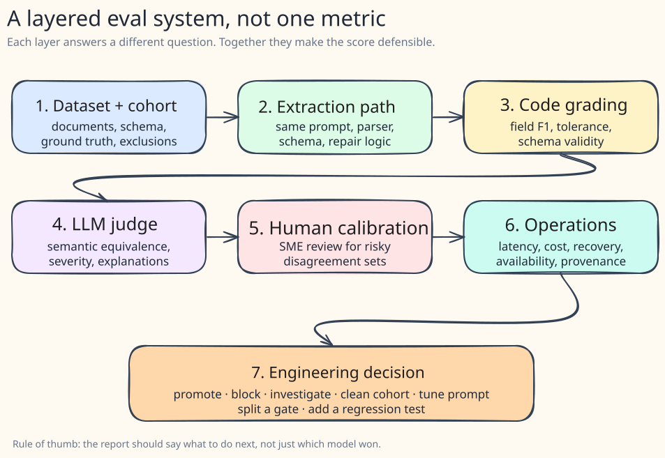
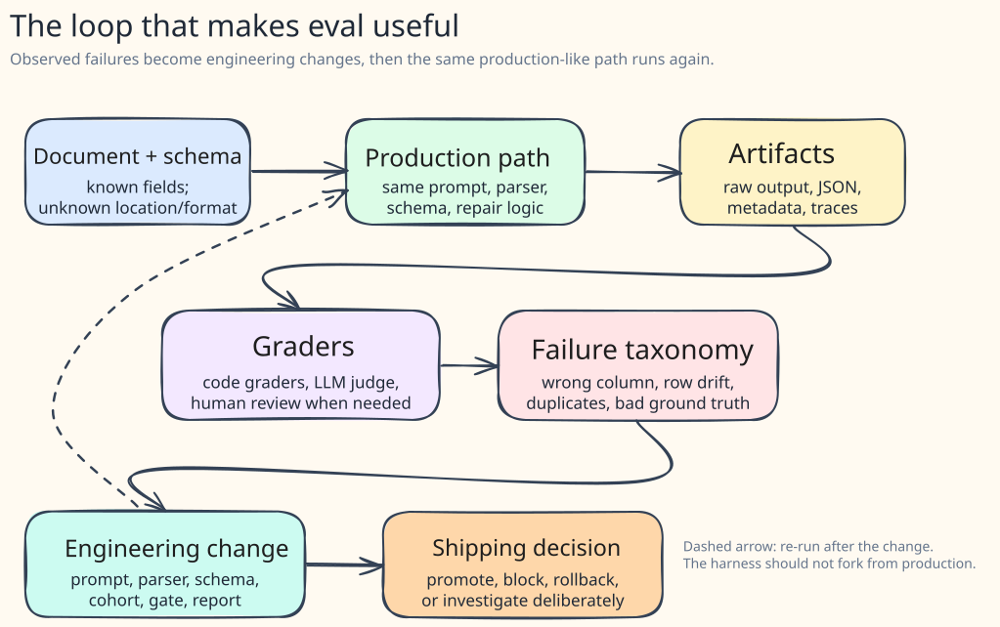

I recently worked on a document-extraction problem that seemed simple on paper.

The documents were already classified. The schema was known. We knew the fields we wanted. Send the PDF pages to a visual language model, get JSON back, compare it to ground truth, and pick the best model.

That plan breaks the moment you touch real PDFs.

The model does not know whether the field exists. It does not know where the field is. The same value might appear in a table, a header, a footnote, a summary section, or a second document accidentally visible on the same page. Some fields are optional. Some labels are semantically close but operationally different. A value can be perfectly valid JSON and still be the wrong number.

So the question changed.

Not: "Which model has the best score?"

The better question was: "Can we make a production decision from this evaluation without fooling ourselves?"

## Step 0 — decide what the eval is for

An eval should support a decision.

That sounds obvious, but it is the first place teams drift. If the decision is "choose a model for production," the eval needs different evidence than a weekend benchmark does. If the decision is "did this prompt change regress tables?" then a single aggregate score is too blunt. If the decision is "can we trust this vendor claim?" then the benchmark needs to use your documents, your schema, and your definition of a correct field.

For document extraction, I like to name the decision before naming the metric:

- promote this model or block it;
- tune the prompt or leave it alone;
- clean the cohort because ground truth is noisy;
- split smoke tests from capability tests;
- change a parser, schema, or recovery gate;
- investigate a specific failure class.

A leaderboard can help. But the leaderboard is not the deliverable.

The deliverable is the next engineering decision.

## Step 1. Evaluate the production path, not a shadow model

The tempting architecture is a standalone eval script: load a model, run it over images, write JSON, grade it.

That is fine for early exploration. It is dangerous for production decisions.

The production system usually has behaviors that the standalone script does not: the actual prompt, the schema version, the model registry name, quantization settings, JSON parsing, JSON repair, retry behavior, output normalization, and metadata. If the eval bypasses that path, it can end up measuring a model-shaped approximation of the system rather than the system itself.

My take: once a model is a serious production candidate, the eval should call the same extraction path that production calls.

It is slower to set up. It creates dependencies on service availability. It also prevents a class of embarrassing mistakes where the model "won" in eval but never behaved that way in the real service.

> [!important]
> Evaluate the production path, not a duplicate harness that happens to use the same model name.

## Step 2. Treat ground truth as an artifact, not a fact from heaven

Ground truth is not automatically true.

Real corpora contain wrong document types, duplicate documents, merged documents, bad labels, oddball edge cases, and values that are technically present but not useful for business decisions. Sometimes the model is wrong. Sometimes the benchmark is wrong. Sometimes, both are doing exactly what they were told to do, but the instructions are bad.

That means a serious extraction benchmark needs cohort hygiene:

- one canonical loader for the evaluation set;
- explicit inclusion and exclusion rules;
- an audit trail for excluded documents;
- schema version pinned to the ground truth;
- a way to separate the smoke, regression, capability, and pathology sets.

This matters more than people expect. A small number of bad documents can move the score enough to change a promotion decision.

Ground truth should be reviewed like code. Versioned like code. Discussed like code.

## Step 3. Separate parseability from correctness

A model can produce cleaner JSON and worse extraction.

This is one of the most useful lessons from the project. We had runs where output validity improved, recovery improved, and the structured JSON looked easier to consume. At the same time, field-level accuracy moved in the wrong direction.

That is not a contradiction. It is two different signals.

Parseability answers: "Can the system consume the output?"

Correctness answers: "Did the system extract the right facts?"

You need both. But they should not be collapsed into one fuzzy sense of "quality." Raw model parse success, repaired JSON success, schema validity, field F1, and judge score each tell a different story.

The production gate should match production reality. If the service repairs JSON before downstream systems receive it, a raw parse failure may be a warning signal rather than a blocking one. On the other hand, if repair makes invalid output consumable but the values are wrong, the eval still needs to block promotion.

My shorthand:

- raw model signals are SLIs;
- production-consumable outputs are closer to SLOs;
- content accuracy still needs its own gate.

## Step 4. Use more than one grader

Field extraction has some brutally deterministic parts.

Amounts either match within tolerance or they do not. Dates can be normalized. Required fields can be present or missing. Arrays can be compared for row count, labels, and numeric values.

Use code graders for that.

But deterministic grading also gets brittle. It can over-penalize harmless formatting differences and under-explain severe semantic mistakes. An LLM judge can help with the gray area: whether two values are semantically equivalent, whether the model confused current-period and year-to-date values, whether a missing row matters, and how severe the error is.

I would not use an LLM judge alone. I also would not skip it for messy documents.

The pattern that worked best was mixed grading:

| Grader | Best at | Weakness |
|---|---|---|
| Code grader | exact fields, numeric tolerance, schema validity, repeatability | brittle for semantic equivalence |
| LLM judge | severity, explanations, disagreement analysis | cost, nondeterminism, needs calibration |
| Human reviewer | domain judgment and trust calibration | slow, expensive, limited scale |

A useful eval report should show where graders agree and where they disagree. The disagreement set is often where the real learning is.

## Step 5. Track failure classes, not just scores

Aggregate scores tell you that something changed. They rarely tell you what to do next.

The actionable signal usually comes from failure classes:

- the model picked the year-to-date column instead of the current-period column;
- table rows drifted out of alignment;
- duplicate rows were emitted;
- a placeholder label from the prompt example leaked into the answer;
- an identifier was copied into a numeric amount field;
- a footnote marker became part of a value;
- the page contained multiple similar documents and the model blended them;
- the document did not belong in the cohort at all.

Once you have those classes, prompt tuning becomes much less mystical. A prompt clause should trace back to an observed failure. If no failure motivated the clause, I am suspicious of it.

This also keeps the team honest. "Improve the prompt" is vague. "Prevent identifiers from being emitted into amount fields" is testable.

## Step 6. Record provenance or ignore the score

A score without provenance is a number with amnesia.

For VLM document extraction, I want every run to tell me at least this:

- model name and checkpoint;
- prompt version or prompt hash;
- schema version;
- extraction service version or image tag;
- evaluation framework version;
- dataset hash or cohort id;
- run timestamp;
- parsing and repair behavior;
- latency, tokens, and cost if available.

Without that metadata, you cannot answer the basic postmortem questions. Did the model improve? Did the prompt change? Did the schema change? Did the parser change? Did the dataset change? Did the service route to a different provider?

If you cannot reproduce the score, do not use it as promotion evidence.

## Step 7. Make promotion a multi-signal decision

The uncomfortable case is when metrics disagree.

One model has better schema validity. Another has better field F1. A prompt change improves parse success but regresses important values. The LLM judge says the difference is minor. The deterministic grader says a high-risk field failed. Latency is acceptable on a small set but risky at volume.

This is normal.

The mistake is pretending one metric can settle it. Document extraction systems sit between AI behavior and business processes. The promotion decision must consider content accuracy, output validity, operational behavior, cost, latency, failure severity, and the blast radius of mistakes.

What I would ship is a report that ends with a decision table:

| Signal | What it answers | Promotion role |
|---|---|---|
| Field F1 / precision / recall | Are values correct by field type? | primary content signal |
| Schema validity / recovery | Can downstream systems consume output? | operational gate |
| LLM judge score | How severe are semantic disagreements? | companion signal |
| Human calibration | Do we trust the judge and ground truth? | trust check |
| Failure taxonomy | What should we fix next? | action driver |
| Cost / latency | Can this run in production? | feasibility check |
| Provenance | Can we reproduce this evidence? | evidence gate |

The report should not end with "Model B wins."

It should end with one of these:

- promote Model B for this cohort;
- block promotion because content regressed;
- run a targeted investigation for table rows;
- clean the cohort and re-run;
- split smoke and capability gates;
- tune the prompt against observed failures;
- add a regression test for this failure class.

## The checklist I use now

If I were starting another VLM document extraction eval tomorrow, I would ask these questions first:

- What decision will this eval support?
- What is the unit of evaluation: document, page, field, row, or workflow?
- Is the schema pinned?
- Is the ground truth reviewed and versioned?
- Are optional and missing fields scored deliberately?
- Does the eval call the production-like extraction path?
- Are raw output, parsed output, and repaired output stored separately?
- Are field metrics specific enough for amounts, dates, labels, tables, and optional fields?
- Is there an LLM judge for semantic disagreement?
- Is there human calibration for high-impact cases?
- Are cost, latency, validity, and recovery measured separately from content accuracy?
- Are failure classes tracked over time?
- Does the report produce an engineering decision?

If the answer to the last question is no, the eval is not finished.

It may have produced metrics. It has not produced judgment yet.

## Revision notes

This draft is based on production work, with identifying details removed. The examples are generalized from document extraction failures I have seen in practice: noisy cohorts, table confusion, schema drift, output repair, and metric disagreement.
