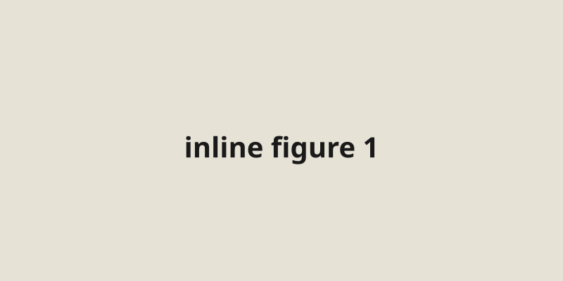

This post has a hero image at the top of the layout, then two inline images mid-body, then a closing paragraph.

The first inline figure sits below this paragraph. Inline images on this theme inherit `max-width: 100%` from the global stylesheet, so they should not break out of the 700px prose column.

A second inline figure follows, in the accent color, so we can see whether two contrasting placeholders side-by-side feel intentional or chaotic in the reading flow.

A closing paragraph. If the bottom margin between the last image and the post tags looks wrong, that's where to tune `.prose img` or the `.tags` top padding.
